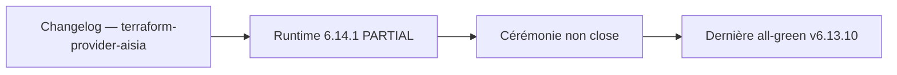

# Changelog — terraform-provider-aisia

Versioning **couplé à AISIA** (la version du provider = la version d'AISIA).

## [6.14.1] — 2026-09-24

### Régénération depuis l'OpenAPI et alignement de version

Les versions **6.13.9 à 6.14.1** n'avaient pas d'entrée individuelle. Contrairement
aux modules, le provider a bien changé sur cette plage : les sources générées
depuis la spécification OpenAPI ont été régénérées — `catalog_generated.go`,
`resources_generated.go`, `catalog_data_sources.go` et leurs tests de contrat.
C'est le mécanisme prévu : la gate `terraform-provider-sync` régénère le
provider à chaque évolution de l'API, de sorte qu'il ne puisse pas diverger.

Aucune ressource écrite à la main n'a été modifiée sur cette plage.

Le binaire 6.14.1 a été construit le 2026-09-24 par le runner auto-hébergé
(`go build -ldflags "-X main.version=6.14.1"`), en matrice multi-plateforme.

## [6.13.8] — 2026-08-23

### Changed
- Entrée rétroactive (TF-02, ajoutée 2026-08-24) : alignement de version sur AISIA v6.13.8 (versioning couplé, `VERSION` → `6.13.8`). `internal/` inchangé — aucune nouvelle resource ni data source. Dernière version courante du code (runtime LIVE = v6.13.1). Surface générée inchangée depuis le resync 6.12.96 : **388 resources write** (10 hand-written + 360 actions + 6 CRUD + 12 singletons générés) et **333 data sources** (5 hand-written + 328 générées), mesuré 2026-08-24 (`grep` sur `internal/provider/*_generated.go` + `docs/resources` = 388 fichiers, `docs/data-sources` = 333 fichiers). Non republié sur registry.terraform.io.

### Notes
- Documente le contrat OpenAPI/HEAD ; ne republie pas sur registry.terraform.io et n'exécute aucun `terraform apply`.

## [6.13.7] — 2026-08-22

### Changed
- Entrée rétroactive (TF-02, ajoutée 2026-08-24) : alignement de version sur AISIA v6.13.7 (versioning couplé, `VERSION` → `6.13.7`). `internal/` inchangé — aucune nouvelle resource ni data source.

### Notes
- Documente le contrat OpenAPI/HEAD ; ne republie pas sur registry.terraform.io et n'exécute aucun `terraform apply`.

## [6.13.6] — 2026-08-22

### Changed
- Entrée rétroactive (TF-02, ajoutée 2026-08-24) : alignement de version sur AISIA v6.13.6 (versioning couplé, `VERSION` → `6.13.6`). `internal/` inchangé — aucune nouvelle resource ni data source.

### Notes
- Documente le contrat OpenAPI/HEAD ; ne republie pas sur registry.terraform.io et n'exécute aucun `terraform apply`.

## [6.13.5] — 2026-08-22

### Changed
- Entrée rétroactive (TF-02, ajoutée 2026-08-24) : alignement de version sur AISIA v6.13.5 (versioning couplé, `VERSION` → `6.13.5`). `internal/` inchangé — aucune nouvelle resource ni data source.

### Notes
- Documente le contrat OpenAPI/HEAD ; ne republie pas sur registry.terraform.io et n'exécute aucun `terraform apply`.

## [6.13.4] — 2026-08-22

### Changed
- Entrée rétroactive (TF-02, ajoutée 2026-08-24) : alignement de version sur AISIA v6.13.4 (versioning couplé, `VERSION` → `6.13.4`). `internal/` inchangé — aucune nouvelle resource ni data source.

### Notes
- Documente le contrat OpenAPI/HEAD ; ne republie pas sur registry.terraform.io et n'exécute aucun `terraform apply`.

## [6.13.3] — 2026-08-22

### Changed
- Entrée rétroactive (TF-02, ajoutée 2026-08-24) : alignement de version sur AISIA v6.13.3 (versioning couplé, `VERSION` → `6.13.3`). `internal/` inchangé — aucune nouvelle resource ni data source.

### Notes
- Documente le contrat OpenAPI/HEAD ; ne republie pas sur registry.terraform.io et n'exécute aucun `terraform apply`.

## [6.13.2] — 2026-08-22

### Changed
- Entrée rétroactive (TF-02, ajoutée 2026-08-24) : alignement de version sur AISIA v6.13.2 (versioning couplé, `VERSION` → `6.13.2`). `internal/` inchangé — aucune nouvelle resource ni data source.

### Notes
- Documente le contrat OpenAPI/HEAD ; ne republie pas sur registry.terraform.io et n'exécute aucun `terraform apply`.

## [6.13.1] — 2026-08-21

### Changed
- Entrée rétroactive (TF-02, ajoutée 2026-08-24) : alignement de version sur AISIA v6.13.1 (versioning couplé, `VERSION` → `6.13.1`). `internal/` inchangé — aucune nouvelle resource ni data source. D'abord posée `6.13.01` (`57e174cc1`) puis normalisée `6.13.1` le même jour (`33dbb348c`).

### Notes
- Documente le contrat OpenAPI/HEAD ; ne republie pas sur registry.terraform.io et n'exécute aucun `terraform apply`.

## [6.12.101] — 2026-08-21

### Changed
- Entrée rétroactive (TF-02, ajoutée 2026-08-24) : alignement de version sur AISIA v6.12.101 (versioning couplé, `VERSION` → `6.12.101`). `internal/` inchangé — aucune nouvelle resource ni data source.

### Notes
- Documente le contrat OpenAPI/HEAD ; ne republie pas sur registry.terraform.io et n'exécute aucun `terraform apply`.

## [6.12.100] — 2026-08-21

### Changed
- Entrée rétroactive (TF-02, ajoutée 2026-08-24) : alignement de version sur AISIA v6.12.100 (versioning couplé, `VERSION` → `6.12.100`). `internal/` inchangé — aucune nouvelle resource ni data source.

### Notes
- Documente le contrat OpenAPI/HEAD ; ne republie pas sur registry.terraform.io et n'exécute aucun `terraform apply`.

## [6.12.99] — 2026-08-21

### Changed
- Entrée rétroactive (TF-02, ajoutée 2026-08-24) : alignement de version sur AISIA v6.12.99 (versioning couplé, `VERSION` → `6.12.99`). `internal/` inchangé — aucune nouvelle resource ni data source.

### Notes
- Documente le contrat OpenAPI/HEAD ; ne republie pas sur registry.terraform.io et n'exécute aucun `terraform apply`.

## [6.12.98] — 2026-08-20

### Changed
- Entrée rétroactive (TF-02, ajoutée 2026-08-24) : alignement de version sur AISIA v6.12.98 (versioning couplé, `VERSION` → `6.12.98`). `internal/` inchangé — aucune nouvelle resource ni data source.

### Notes
- Documente le contrat OpenAPI/HEAD ; ne republie pas sur registry.terraform.io et n'exécute aucun `terraform apply`.

## [6.12.97] — 2026-08-19

### Changed
- Entrée rétroactive (TF-02, ajoutée 2026-08-24) : alignement de version sur AISIA v6.12.97 (versioning couplé, `VERSION` → `6.12.97`). `internal/` inchangé — aucune nouvelle resource ni data source. Le resync OpenAPI `43393cdec` (2026-08-18, +2 actions `admin_ai_quality_evaluate`/`admin_finops_invoice_matches`, +7 data sources) est intervenu **avant** ce bump, sous VERSION 6.12.96 — voir le complément ajouté à l'entrée [6.12.96].

### Notes
- Documente le contrat OpenAPI/HEAD ; ne republie pas sur registry.terraform.io et n'exécute aucun `terraform apply`.

## [6.12.96] — 2026-08-18

### Changed
- Alignement de version sur AISIA v6.12.96 (versioning couplé). **Aucune nouvelle
  ressource d'écriture Terraform** : la parité write reste épinglée à **9 hand-written
  + 18 exclusions** (`tests/test_terraform_provider_contract_parity.py`, vérifié).
- GPT-UPG-006 : `GET /admin/mcp/status` et alias `/admin/mcp-servers` restent les
  mêmes chemins OpenAPI (extrait router, pas de nouvelle resource write). Module
  Google public registry = 🔒 VCS UI fondateur.

### Fixed (complément 2026-08-24, TF-02)
- ⚠️ Correction d'honnêteté : le resync `fix(release): resync provider Terraform sur
  OpenAPI 6.12.96` (`43393cdec`, 2026-08-18) — postérieur à la rédaction de cette entrée
  mais réalisé sous VERSION 6.12.96 — a AJOUTÉ 2 resources write générées
  (`aisia_admin_ai_quality_evaluate_action`, `aisia_admin_finops_invoice_matches_action`)
  et 7 data sources générées (dont `admin_delivery_program`, `admin_l1_l6_progress`,
  `admin_honesty_unimplemented`). La phrase « Aucune nouvelle ressource d'écriture »
  ci-dessus ne vaut que pour les resources hand-written ; la surface GÉNÉRÉE a bien changé.

### Notes
- Documente le contrat OpenAPI/HEAD ; ne republie pas sur registry.terraform.io et
  n'exécute aucun `terraform apply`.

## [6.12.95] — 2026-08-18

### Changed
- Alignement de version sur AISIA v6.12.95 (versioning couplé). Provider inchangé
  fonctionnellement (parité write 9+18 stable).

### Notes
- Documente le contrat OpenAPI/HEAD ; pas de republication ni d'`apply`.

## [6.12.94] — 2026-08-18

### Added
- Surface admin : `GET /admin/auto-test`, `POST /admin/auto-test` (job Redis 202),
  `GET /admin/auto-test/jobs/{job_id}`, `POST /admin/connectors/mcp/servers/{id}/probe`.
- Alias GOV-01 : `ai-act`, `b2b`, `backup`, `blog`, `cluster`, `dr`, `egress`,
  `i18n`, `orgs` → pages dédiées existantes.

### Changed
- `POST /admin/autonomy/reload` répond 202 (demande persistée, replicas_acked=unknown)
  au lieu d'un 501 ou d'un faux succès replica unique.
- Restore backups : `request_id` persisté ; pas d'exécution automatique cluster.

### Notes
- Cette entrée documente le contrat OpenAPI/HEAD. Elle ne republie pas le
  provider sur registry.terraform.io et n'exécute aucun `terraform apply`.
- Module Google public : toujours 🔒 VCS UI.

## [6.12.81] — 2026-08-05

### Changed
- Alignement de version sur AISIA v6.12.81 (versioning couplé). Déjà publié publiquement
  sur registry.terraform.io (vérifié : `aisia-foundation/aisia` v6.12.81 disponible,
  installable via `~> 6.12`). Provider inchangé fonctionnellement. ⚠️ Contrairement aux
  modules `terraform-registry/*`, ce provider ne porte pas de variable `image_tag` — le
  couplage de version ne pose donc pas le même risque de « tag d'image inexistant » que
  celui corrigé cette session sur les modules per-cloud.

## [6.12.80] — 2026-08-05

### Changed
- Alignement de version sur AISIA v6.12.80 (versioning couplé, release AISIA LIVE certifiée
  DEPLOY-REPORT all-green). Entrée rétroactive (bump réel non documenté au moment du commit
  `38058f47f`). Provider inchangé fonctionnellement.

## [6.12.79] — 2026-08-04

### Changed
- Alignement de version sur AISIA v6.12.79 (versioning couplé). Entrée rétroactive (bump
  réel non documenté au moment du commit `0ac97ec9d`). Provider inchangé fonctionnellement.

## [6.12.78] — 2026-08-04

### Changed
- Alignement de version sur AISIA v6.12.78 (versioning couplé, docs/index.md +
  guides/getting-started.md + README régénérés). Rattrape aussi le saut `v6.12.77`
  (VERSION bumpé sans entrée CHANGELOG par le commit `ad31e4ac8`, jamais publié).
  Corrige aussi la contrainte de version obsolète `~> 6.9` dans `examples/provider/
  provider.tf` et `examples/complete/main.tf` (→ `~> 6.12`, alignée sur README/docs).
  Provider inchangé fonctionnellement (resources/data sources stables) — préparation
  publication, pas de build/signature ici.

## [6.12.76] — 2026-08-02

### Changed
- Alignement de version sur AISIA v6.12.76 (versioning couplé, docs/index.md +
  guides/getting-started.md + README régénérés). Provider inchangé fonctionnellement
  (resources/data sources stables) — préparation publication, pas de build/signature ici.

## [6.9.63] — 2026-06-30

### Changed
- Alignement de version sur AISIA v6.9.63 (versioning couplé). Sprint durcissement sécurité
  (authz get_root_admin/scoping, helper anti-SSRF, verify=True, agents non-autonomes) + fixes
  audit admin. Provider inchangé fonctionnellement (resources/data sources stables).

## [6.9.61] — 2026-06-29

### Changed
- Alignement de version sur AISIA v6.9.61 (versioning couplé). Embarque le batch Voie A
  (cache sémantique TTL, /metrics bot+agent exposés, AsyncMock corrigés, E2E B2B). Provider
  inchangé fonctionnellement (resources/data sources stables).
- Modules cloud (azure/ovh/scaleway/aws/gcp) : `image_tag` default → v6.9.61 ; versions.tf
  présents partout ; parité K8s+Swarm sur GCP. Module `terraform-aisia-cluster` reste SemVer 1.0.1.

## [6.9.60] — 2026-06-29

### Changed
- Alignement de version sur AISIA v6.9.60 (versioning couplé). Aucun changement fonctionnel
  du provider : resources/data sources inchangés (organizations, users, api_keys, provider_keys).
- Embarque les correctifs v6.9.49-59 : SEC-1 (providers 401 anonyme), AI Act Art.50,
  OOM api, leak Qdrant crew, Redis Sentinel 56s, DDL CrateDB bootstrap.

## [6.9.48] — 2026-06-29

### Changed
- Alignement de version sur AISIA v6.9.48 (versioning couplé). Aucun changement fonctionnel
  du provider depuis 6.9.30 : resources/data sources inchangés. Entrée ajoutée pour rétablir
  la continuité du changelog (IND-6) figé à 6.9.30 alors qu'AISIA avançait.

## [6.9.30] — 2026-06-24

### Added
- Scaffold initial du provider (terraform-plugin-framework, protocol v6).
- Provider config : `endpoint` (env `AISIA_ENDPOINT`) + `token` (env `AISIA_TOKEN`, sensible).
- Resource `aisia_organization` (CRUD via /admin/organizations) + data source.
- Resources `aisia_user` (CRUD /admin/users, mot de passe auto-généré one-shot) + `aisia_api_key` (clé programmatique org, one-shot, immuable).
- Resource `aisia_provider_key` (clé provider par org, KEY-2, write-only, import `org_id/provider_id`).
- Client HTTP Bearer, GoReleaser + signature GPG, CI (test + release), exemples, docs registry manifest.
- Couplage de version automatisé via `scripts/bump_version.py`.

## Relecture release 6.14.1

Revue du 2026-09-24 pour la release dont le code et le runtime mesuré sont **6.14.1**. `/health` répond 6.14.1, la classe publique est `LIVE_PARTIAL`, `ceremony_complete` est faux. La dernière cérémonie all-green scellée reste **v6.13.10**. Cette relecture ne ferme pas la cérémonie.

Document relu : Changelog — terraform-provider-aisia.

Extrait conservé : Versioning **couplé à AISIA** (la version du provider = la version d'AISIA).

Ce fichier garde son rôle d'origine. S'il décrit une campagne, un changelog ou un modèle daté, cette date reste valable. Seul l'état de production ci-dessus est celui du 2026-09-24.

