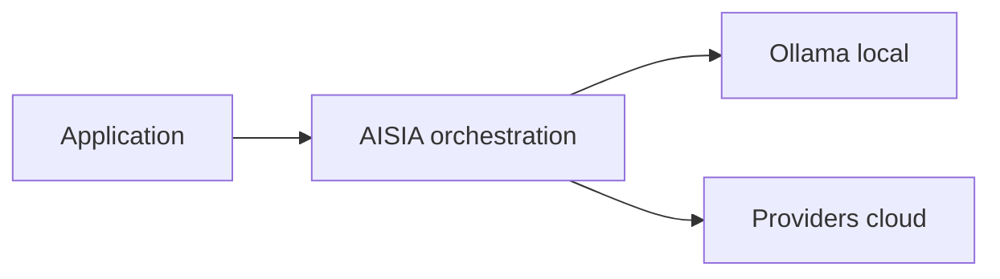

<!--
  GÉNÉRÉ — ne pas éditer à la main.
  Source: scripts/generate/09_publications.py
  Régénérer: python3 scripts/aisia.py regen
  Gate deploy: python3 scripts/release/deploy.py <ver> --mode docs
-->

> **Prod live vérifiée** : **v6.12.65** (2026-07-17) — chiffres : `project_facts.json` · régénéré par `09_publications.py`.

# Terraform Provider AISIA

[](https://app.terraform.io/app/AISIA/registry/providers/private/AISIA/aisia)
[](./LICENSE)

Provider Terraform officiel pour **AISIA** — organisations, clés providers par org,
utilisateurs et clés API en **Infrastructure-as-Code** (`api.aisia.fr`).

## Cœur d'AISIA (identité produit)

AISIA est le **chef d'orchestre IA local-first** : une requête entre, le meilleur modèle (local ou cloud) exécute, la réponse sort traçable et gouvernée.

**Fonction première** : orchestrer chaque requête IA en **local-first** (Ollama sur cluster)
puis cloud si nécessaire — via `BanditRouter`, pas un simple reverse-proxy.

**Différenciation** : orchestration local-first — pas un proxy LLM stateless.

| vs proxy LLM | AISIA |
|--------------|-------|
| 1 provider fixe | **88** providers + **58** modèles locaux |
| Stateless | Qdrant + audit AI Act + multi-tenant |
| SaaS opaque | Déployable Swarm/K8s — **v6.12.65** LIVE |

Documentation : [README racine](./README.md) ·
[Product Identity](./specification/03-Project-State/Product-Identity-AISIA.md)




---

## Ce que ce provider vous permet de faire

- Gérer vos **organisations** (tenants), **clés providers** isolées par org, **utilisateurs** et **clés d'API**.
- **Multi-tenant** : isolation par organisation, quotas, déploiement self-service.
- **IaC** : ce provider (gérer AISIA) + module [`terraform-aisia-cluster`](https://app.terraform.io/app/AISIA/registry/modules/private/AISIA/aisia/kubernetes) (déployer AISIA).
- **Guide** : [getting-started](docs/guides/getting-started.md) — parcours déployer + gérer en Terraform.

> Module (déployer) **+** provider (gouverner) = cycle de vie complet en Terraform.

---

## Démarrage rapide

```hcl
terraform {
  required_providers {
    aisia = {
      source  = "app.terraform.io/AISIA/aisia"
      version = "~> 6.12"
    }
  }
}

provider "aisia" {
  # endpoint = "https://api.aisia.fr"
  # token via AISIA_TOKEN
}

resource "aisia_organization" "acme" {
  name          = "ACME Corp"
  slug          = "acme"
  contract_type = "saas"
}
```

## Authentification

| Variable | Rôle |
|----------|------|
| `AISIA_ENDPOINT` | URL API (défaut `https://api.aisia.fr`) |
| `AISIA_TOKEN` | Jeton admin Bearer — **sensible** |

## Versioning

Provider **couplé à AISIA** : `aisia 6.12.65` cible la plateforme **v6.12.65**.

## Développement

```bash
make build && make validate && make docs
```

## Licence

[MPL-2.0](./LICENSE)
