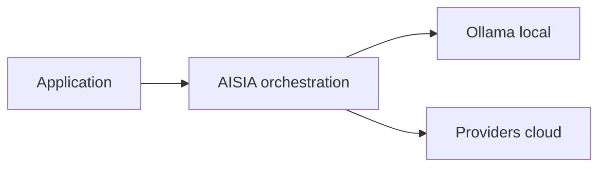

<!--
  GÉNÉRÉ — ne pas éditer à la main.
  Source: scripts/generate/09_publications.py
  Régénérer: python3 scripts/aisia.py regen
  Gate deploy: python3 scripts/release/deploy.py <ver> --mode docs
-->

> **Prod live vérifiée** : **v6.12.93** (2026-08-17) · **code cible v6.12.94** 🟡 (tagué ; images/rolling non faits — LIVE reste v6.12.93) — chiffres : `project_facts.json` · régénéré par `09_publications.py`.

# Terraform Provider AISIA

[](https://registry.terraform.io/providers/aisia-foundation/aisia/latest)
[](./LICENSE)

Provider Terraform officiel pour **AISIA** — organisations, clés providers par org,
utilisateurs et clés API en **Infrastructure-as-Code** (`api.aisia.fr`).

## Cœur d'AISIA (identité produit)

AISIA est le **chef d'orchestre IA local-first** : une requête entre, le meilleur modèle (local ou cloud) exécute, la réponse sort traçable et gouvernée.

**Fonction première** : orchestrer chaque requête IA en **local-first** (Ollama sur cluster)
puis cloud si nécessaire — via `BanditRouter`, pas un simple reverse-proxy.

**Différenciation** : orchestration local-first — pas un proxy LLM stateless.

| vs proxy LLM | AISIA |
|--------------|-------|
| 1 provider fixe | **88** providers déclarés |
| Catalogue modèles | **866** modèles catalogue · **123** locaux déclarés · **58** locaux enabled |
| Stateless | Qdrant + audit AI Act + multi-tenant |
| SaaS opaque | Déployable Swarm/K8s — runtime **v6.12.93** · code **v6.12.94** |

Documentation : [README racine](../../../README.md) ·
[Product Identity](../../../specification/03-Project-State/Product-Identity-AISIA.md)


```mermaid
flowchart LR
  App[Application] --> AISIA[AISIA orchestration]
  AISIA --> Local[Ollama local]
  AISIA --> Cloud[Providers cloud]
```


---

## Ce que ce provider vous permet de faire

- Gérer vos **organisations** (tenants), **clés providers** isolées par org, **utilisateurs** et **clés d'API**.
- **Multi-tenant** : isolation par organisation, quotas, déploiement self-service.
- **IaC** : ce provider (gérer AISIA) + module public [`aisia-foundation/cluster/aisia`](https://registry.terraform.io/modules/aisia-foundation/cluster/aisia/latest) (déployer AISIA).
- **Guide** : [getting-started](docs/guides/getting-started.md) — parcours déployer + gérer en Terraform.

> Module (déployer) **+** provider (gouverner) = cycle de vie complet en Terraform.

---

## Démarrage rapide

```hcl
terraform {
  required_providers {
    aisia = {
      source  = "aisia-foundation/aisia"
      version = "~> 6.12"
    }
  }
}

provider "aisia" {
  # endpoint = "https://api.aisia.fr"
  # token via AISIA_TOKEN
}

resource "aisia_organization" "acme" {
  name          = "ACME Corp"
  slug          = "acme"
  contract_type = "saas"
}
```

## Authentification

| Variable | Rôle |
|----------|------|
| `AISIA_ENDPOINT` | URL API (défaut `https://api.aisia.fr`) |
| `AISIA_TOKEN` | Jeton admin Bearer — **sensible** |

## Versioning

Provider **couplé à AISIA** : tag monorepo **v6.12.94** (fichier `VERSION`) · PROD LIVE documentaire **v6.12.93**.

<!-- TF-REGISTRY-STATUS -->
## Statut publication registry (honnête)

> Mesuré à la régénération docs · **version code TF** **v6.12.94** (`VERSION` modules + provider) · PROD LIVE documentaire **v6.12.93**.

| Artefact | Repo | Public registry.terraform.io |
|----------|------|------------------------------|
| Provider `aisia-foundation/aisia` | `6.12.94` | **6.12.93** ❌ écart |
| Module `terraform-aisia-cluster` (`cluster/aisia`) | `6.12.94` | **6.12.93** ❌ écart |
| Module `terraform-aisia-swarm` (`swarm/aisia`) | `6.12.94` | **6.12.93** ❌ écart |
| Module `terraform-aws-aisia` (`aisia/aws`) | `6.12.94` | **6.12.93** ❌ écart |
| Module `terraform-azure-aisia` (`aisia/azure`) | `6.12.94` | **6.12.93** ❌ écart |
| Module `terraform-google-aisia` (`aisia/google`) | `6.12.94` | **absent public** ⚠️ |
| Module `terraform-ovh-aisia` (`aisia/ovh`) | `6.12.94` | **6.12.93** ❌ écart |
| Module `terraform-scaleway-aisia` (`aisia/scaleway`) | `6.12.94` | **6.12.93** ❌ écart |

HCP privé (`app.terraform.io/AISIA`) : modules + provider publiés via `scripts/ops/publish_terraform.sh --apply` (mesuré hors ce tableau). Ne pas écrire « 100 % registry public » si Google public est absent.


## Développement

```bash
make build && make validate && make docs
```

## Licence

[MPL-2.0](./LICENSE)
