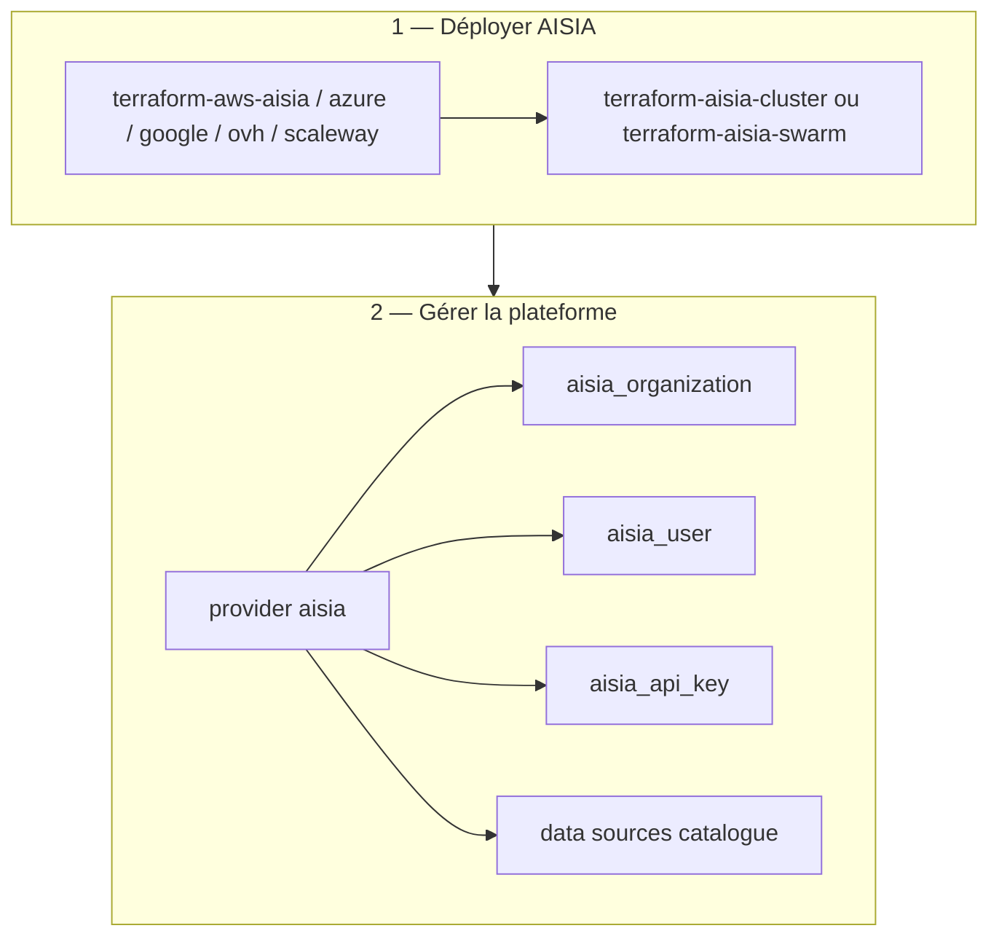

<!-- TF-DOCS-ENRICH:09_publications -->
> **Version LIVE** : **v6.12.54** (2026-07-16) — guide synchronisé avec le provider et les modules registry.

# Guide d'implémentation Terraform AISIA

Ce guide couvre le parcours complet : **déployer** la plateforme (modules) puis **gérer** la configuration (provider).

## Documentation complémentaire

| Ressource | Lien |
|-----------|------|
| Documentation produit | [aisia.fr/docs](https://aisia.fr/docs) |
| Référence API OpenAPI | [api.aisia.fr/docs](https://api.aisia.fr/docs) |
| Provider registry | [registry.terraform.io/.../aisia](https://registry.terraform.io/providers/aisia-foundation/aisia/latest/docs) |
| Modules registry | [terraform-registry/README.md](../../../../terraform-registry/README.md) |

## Architecture IaC



## Étape 1 — Déployer sur Kubernetes (module cœur)

```terraform
terraform {
  required_providers {
    aisia = {
      source  = "aisia-foundation/aisia"
      version = "~> 6.12"
    }
  }
}

module "aisia" {
  source  = "aisia-foundation/cluster/aisia"
  version = "~> 1.0"

  image_tag          = "v6.12.54"
  domain             = "client.example.com"
  tier               = "saas"
  enable_autoscaling = true
  enable_tls         = true
}
```

## Étape 2 — Configurer le provider

```terraform
provider "aisia" {
  endpoint = "https://api.aisia.fr"
  # token via variable d'environnement AISIA_TOKEN (recommandé)
}

resource "aisia_organization" "acme" {
  name          = "ACME Corp"
  slug          = "acme"
  contract_type = "saas"
}

resource "aisia_api_key" "automation" {
  name   = "terraform-ci"
  org_id = aisia_organization.acme.id
}
```

## Étape 3 — Lire les catalogues (data sources)

```terraform
data "aisia_providers" "cloud" {}
data "aisia_local_models" "edge" {}

locals {
  providers = jsondecode(data.aisia_providers.cloud.json)
  models    = jsondecode(data.aisia_local_models.edge.json)
}
```

## Étape 4 — Déploiement cloud managé (optionnel)

```terraform
module "aisia_gcp" {
  source  = "aisia-foundation/aisia/google"
  version = "~> 1.0"

  project_id  = var.gcp_project
  region      = "europe-west9"
  image_tag   = "v6.12.54"
  domain      = "aisia.client.example.com"
  runtime_kind = "k8s"
}
```

## Bonnes pratiques

1. **Secrets** : `AISIA_TOKEN` en variable d'environnement, jamais en clair dans le state.
2. **Version couplée** : provider `~> 6.12` aligné sur la plateforme **v6.12.54**.
3. **Data sources catalogue** : toujours `jsondecode(...json)` — schéma API évolutif.
4. **Resources générées** : préférer `body = jsonencode({...})` si attributs typés absents.

## Documentation AISIA

- [aisia.fr/docs](https://aisia.fr/docs)
- [api.aisia.fr/docs](https://api.aisia.fr/docs)
- [Index provider](../index.md)
